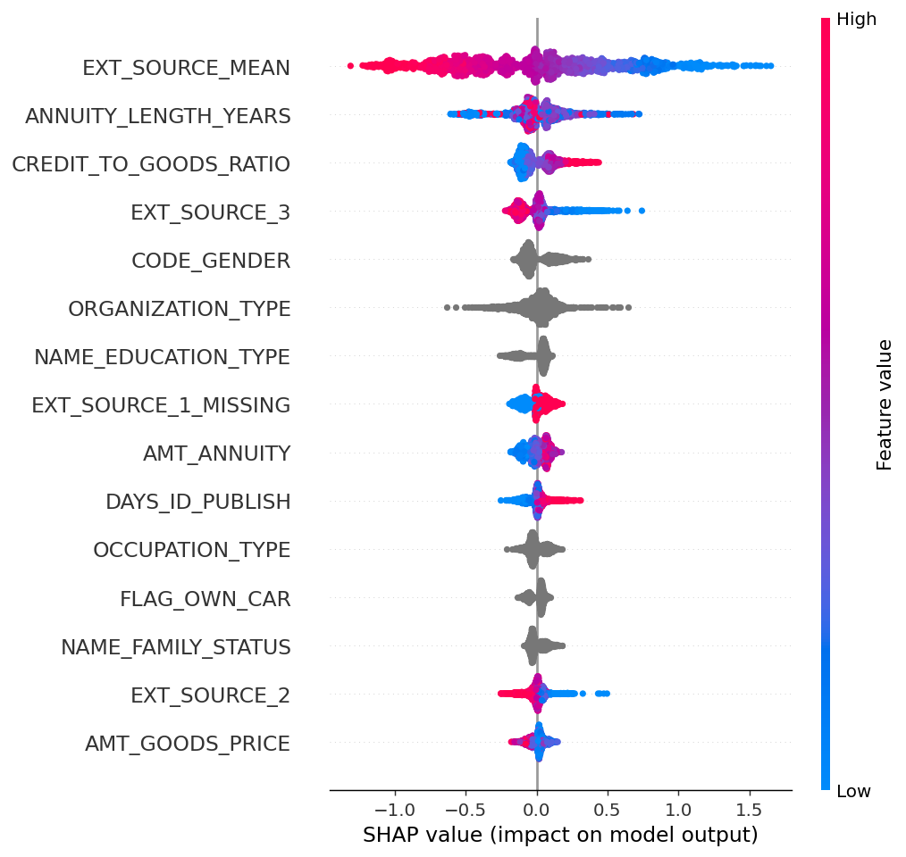

# Credit Risk Scoring — Loan Default Prediction

An end-to-end credit risk model: raw Kaggle data → cleaned features → LightGBM
classifier → cost-based decision threshold → SHAP explanations → deployed API
+ UI. Built as a portfolio project for Data Scientist / AI-ML roles at
analytics-consulting and fintech firms.

**Live demo:**
- API (FastAPI + docs): https://credit-risk-api-v2.onrender.com/docs
- UI (Streamlit): *[add link once the frontend Space is deployed]*

> The API runs on Render's free tier, which spins down after 15 minutes of
> inactivity. The **first** request after a period of idleness can take
> 30–60 seconds to respond while the container wakes up — that's expected,
> not a bug. Subsequent requests are fast.

---

## Problem statement

A lender has to decide, for every loan application, whether to approve it —
and every wrong decision costs money in a different way:

- **Approve a loan that defaults** → lose most of the principal (a false
  negative).
- **Reject an applicant who would have repaid** → lose the interest income
  you'd have earned, and possibly the customer entirely (a false positive).

These two mistakes are not equally expensive, and the applicant population
is heavily imbalanced (roughly 8% of loans in this dataset eventually
default). A model that reports 92% accuracy by approving everyone is
useless. The goal here isn't just "predict default probability" — it's
**produce a risk score, an explanation for that score, and a decision
threshold that's actually justified by the real costs involved.**

**Dataset:** [Home Credit Default Risk](https://www.kaggle.com/c/home-credit-default-risk)
(Kaggle), `application_train.csv` — 307,511 applicants, 122 raw columns,
8.07% true default rate.

---

## Results

| Model | Test PR-AUC | Test ROC-AUC |
|---|---|---|
| Logistic Regression (baseline) | 0.234 | 0.751 |
| **LightGBM (deployed)** | **0.262** | **0.769** |

PR-AUC (not accuracy) is the headline metric here, because with an 8% positive
rate, accuracy is trivially high for a useless model. PR-AUC measures how well
the model ranks applicants by risk across every possible threshold — a far
more honest number for an imbalanced problem.

### The imbalance-handling result that mattered more than expected

The standard advice for an ~8% positive rate is to reweight the loss
(`class_weight='balanced'`) or resample (SMOTE). Both were tested empirically
rather than assumed:

| Approach | PR-AUC (3-fold CV) |
|---|---|
| No reweighting | **0.225** |
| `class_weight='balanced'` | 0.224 |
| SMOTE | 0.220 |

Reweighting didn't help — and for LightGBM specifically, `scale_pos_weight`
actively hurt, collapsing early-stopping from ~700 useful boosting rounds down
to single digits. The reason: PR-AUC and ROC-AUC are *ranking* metrics — they
score how well the model orders applicants by risk, not how many it flags at
one fixed threshold. Reweighting shifts the decision boundary for a threshold
you haven't chosen yet; it doesn't improve the underlying ranking, and it can
distort probability calibration while it's at it.

So both models here are trained **unweighted**, and the imbalance is handled
downstream — at threshold selection, where it actually has business meaning
(see below).

---

## Business memo: what threshold should we actually use?


**The question.** A model outputs a probability. Turning that into an
approve/reject decision requires picking a threshold — and 0.5 is not a
principled choice, it's just the default nobody challenged.

**The method.** For every applicant in the test set, we computed what a
wrong decision would actually cost:
- **Missed default (false negative):** assumed **45% loss given default**
  (a standard unsecured-consumer-credit assumption) applied to that
  applicant's actual requested credit amount — not a flat number across the
  whole portfolio.
- **Wrongly rejected good applicant (false positive):** assumed **2.5% net
  interest margin** lost on that applicant's credit amount.

We then swept every threshold from 0.5% to 95% and found the one that
minimizes total expected cost across the test set.

**The result.**

| Threshold | Total expected cost | Missed defaults | Rejected good applicants | Approval rate |
|---|---|---|---|---|
| 0.5 (naive default) | ₹1.22B | very few | very few | ~99% |
| **0.0475 (cost-optimal)** | **₹0.61B** | 729 | 28,308 | 47.1% |

**That's a 50.5% reduction in expected cost** from choosing the right
threshold instead of the conventional one — a bigger lever than most of the
modeling choices upstream of it.

A pure cost-minimizing policy
here rejects more than half of all applicants. That's because, under these
assumptions, a missed default costs roughly **18x** more than a wrongly
rejected good applicant (45% vs 2.5% of the loan amount) — so the
math pushes hard toward caution. A real bank would almost certainly not
deploy this threshold as-is: a 47% approval rate would collide with growth
targets, competitive pressure, and fair-lending regulatory scrutiny long
before it reached this optimum. The honest framing for this project isn't
"here is the threshold to use" — it's **"here is what the numbers say, and
here is the operational reality that would pull the actual deployed
threshold back toward 0.5."** That tension is the actual deliverable of this
analysis, not a rounding error to smooth over.

**Caveat on the assumptions.** The 45% LGD and 2.5% NIM figures are
reasonable industry-typical numbers, not measurements — they're intentionally
named constants (`src/evaluate.py`) so a real risk team could swap in their
own figures and get an updated answer in seconds.

---

## Explainability

Every prediction ships with a SHAP breakdown (LightGBM `TreeExplainer`,
exact — not an approximation) showing the top factors pushing that specific
applicant's risk up or down, converted from SHAP's native log-odds scale into
an approximate probability-point impact for readability.

Global feature importance (top 15, by mean |SHAP value| across a test sample):



`EXT_SOURCE_MEAN` (an engineered average of three external bureau scores)
dominates, followed by loan-structure ratios (`ANNUITY_LENGTH_YEARS`,
`CREDIT_TO_GOODS_RATIO`) and demographics.

---

## Architecture

```
┌─────────────────────┐         POST /predict          ┌──────────────────────┐
│  Streamlit frontend │ ──────────────────────────────▶ │   FastAPI backend     │
│  (Streamlit Cloud)  │ ◀────────────────────────────── │   (Render, Docker)    │
│                      │      JSON: probability,        │                       │
│  - applicant form    │      risk band, decision,      │  - pydantic schema    │
│  - SHAP factor bars  │      SHAP factors               │  - data_pipeline.py   │
└─────────────────────┘                                 │    (clean+engineer)  │
                                                         │  - LightGBM model     │
                                                         │  - SHAP TreeExplainer │
                                                         └──────────────────────┘
                                                                    ▲
                                                                    │ trained offline, artifacts committed
                                                                    │
                                                         ┌──────────────────────┐
                                                         │   Training pipeline   │
                                                         │   (run locally)       │
                                                         │                       │
                                                         │  data_pipeline.py     │
                                                         │  train.py             │
                                                         │  evaluate.py          │
                                                         └──────────────────────┘
```

The API and UI are deployed as two independent services communicating over a
real HTTP boundary — not a single monolithic script — so either side can be
tested, versioned, or replaced without touching the other. `data_pipeline.py`
is imported by *both* the training script and the live API, guaranteeing
training and serving can never quietly drift apart from each other.

---

## Project structure

```
credit-risk-app/
├── data/
│   ├── raw/              # application_train.csv goes here (not committed - 158MB)
│   └── processed/        # cleaned/engineered parquet (regenerated, not committed)
├── src/
│   ├── data_pipeline.py  # cleaning + feature engineering, shared by training & serving
│   ├── train.py          # baseline LR + LightGBM, imbalance-handling experiments
│   ├── evaluate.py        # PR-AUC, cost-based threshold sweep
│   └── explain.py         # SHAP explainer wrapper
├── api/
│   ├── main.py            # FastAPI app, /predict endpoint
│   └── schemas.py         # request/response models
├── app/
│   └── streamlit_app.py   # frontend, calls the API
├── deploy/
│   ├── api-space/         # trimmed, deployable copy of the API (→ Render)
│   └── streamlit-space/   # trimmed, deployable copy of the UI (→ Streamlit Cloud)
├── models/                # trained artifacts (committed - needed for the API to run)
├── tests/                 # pipeline, explainability, and API tests
├── reports/               # PR curve, cost curve, SHAP summary plots
└── requirements.txt
```

---

## Running it locally

### 1. Clone and set up a virtual environment

```bash
git clone https://github.com/Adigit2211/Credit_Risk_Scoring.git
cd Credit_Risk_Scoring
python3 -m venv venv
source venv/bin/activate        # Windows: venv\Scripts\activate
pip install -r requirements.txt
```

**macOS users:** LightGBM needs the OpenMP runtime, which isn't installed by
default. If you see `Library not loaded: @rpath/libomp.dylib`, run:
```bash
brew install libomp
```

### 2. Get the dataset

Download `application_train.csv` from
[Kaggle](https://www.kaggle.com/c/home-credit-default-risk) (requires joining
the competition), then:
```bash
mv application_train.csv data/raw/application_train.csv
```

### 3. Run the pipeline, train, and evaluate

```bash
PYTHONPATH=. python3 src/data_pipeline.py   # clean + engineer features
PYTHONPATH=. python3 src/train.py           # baseline LR + LightGBM
PYTHONPATH=. python3 src/evaluate.py        # cost-based threshold analysis
PYTHONPATH=. python3 src/explain.py         # SHAP smoke test on one row
```

### 4. Run the tests

```bash
PYTHONPATH=. python3 tests/test_pipeline.py
PYTHONPATH=. python3 tests/test_explain.py
PYTHONPATH=. python3 tests/test_api.py
```

### 5. Run the API and UI locally

```bash
# terminal 1
PYTHONPATH=. uvicorn api.main:app --reload --port 8000

# terminal 2
PYTHONPATH=. streamlit run app/streamlit_app.py
```

Visit `http://localhost:8000/docs` for the API, or `http://localhost:8501`
for the full UI.

---

## Deployment

- **API** → Render (free Web Service, Docker). Deployed from the
  `deploy/api-space/` subfolder, which contains a trimmed dependency set
  (no training-only libraries like `imbalanced-learn` or `matplotlib`) and
  only the model artifacts needed for inference.
- **UI** → Streamlit Community Cloud, deployed from `deploy/streamlit-space/`,
  configured with an `API_URL` variable pointing at the Render API's public
  URL.

Both were originally planned for Hugging Face Spaces, but HF moved Docker
Spaces behind a paid plan shortly before deployment — Render + Streamlit
Cloud are the current free equivalent.

---

## Known limitations (and what I'd do differently in production)

- **Live-inference field set is smaller than the training set.** The
  deployed form collects ~20 applicant-facing fields; the model was trained
  on 87. The gap is mostly internal/administrative columns (e.g.
  `FLAG_DOCUMENT_3`, `REGION_RATING_CLIENT`) that a walk-in applicant
  couldn't sensibly supply — LightGBM's native missing-value handling covers
  them at inference time, but a production version would either wire these
  up via internal system integrations or retrain a leaner model on exactly
  the fields the live form can supply, avoiding train-serve skew entirely.
- **Bureau scores (`EXT_SOURCE_1/2/3`) are optional user inputs** in the demo,
  standing in for what would really be a live bureau-API integration.
- **Cost assumptions (45% LGD, 2.5% NIM) are illustrative, not measured** —
  named as constants specifically so they're easy to challenge and replace.
- **Render's free tier sleeps after 15 minutes of inactivity**, causing a
  cold-start delay on the first request after idle time — acceptable for a
  portfolio demo, not for production traffic.
- **Building the full relational feature set** (bureau history, previous
  applications, installment payments — the other 6 tables in the Home Credit
  dataset) would likely add predictive lift, but was deliberately out of
  scope to keep the live-inference contract realistic and the project
  focused.
